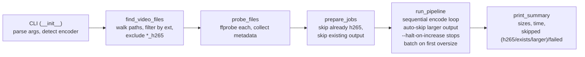
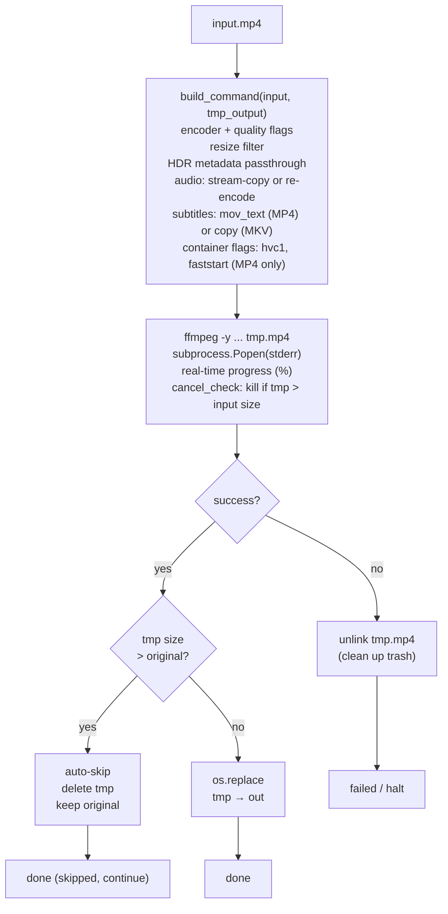
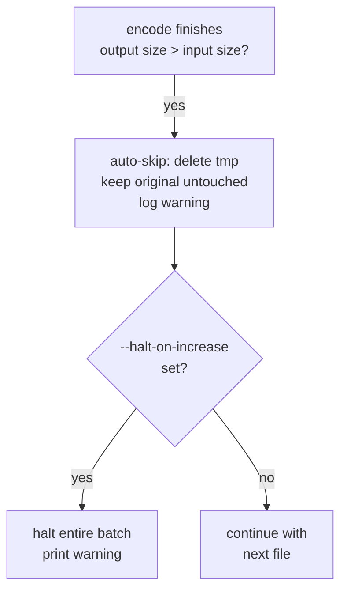
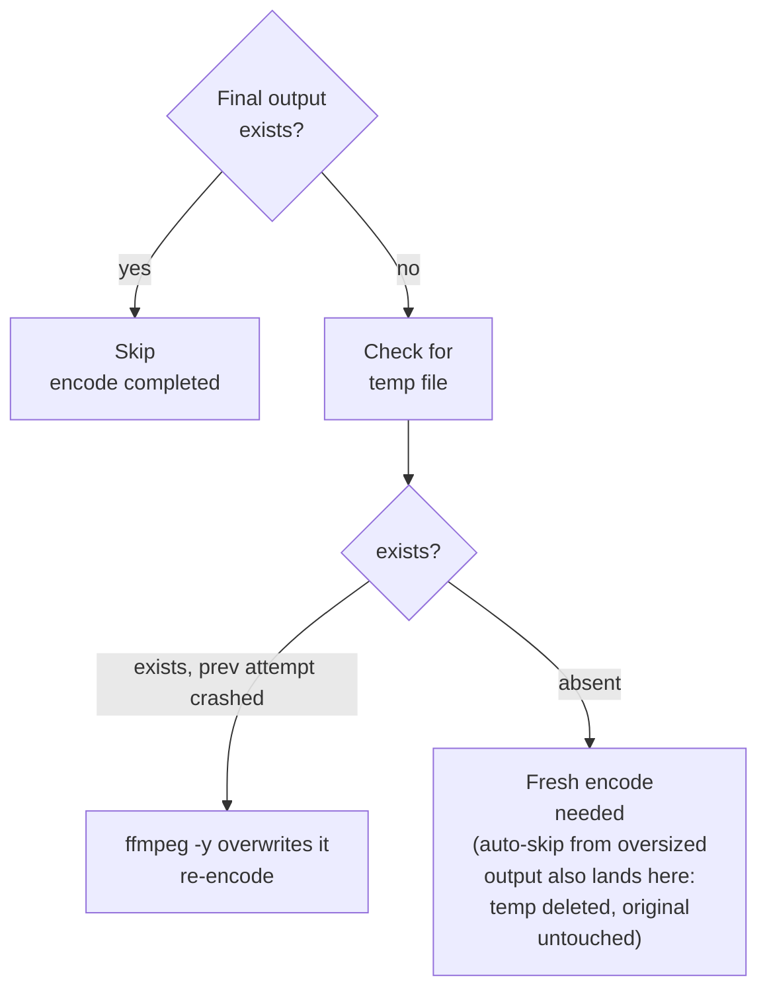
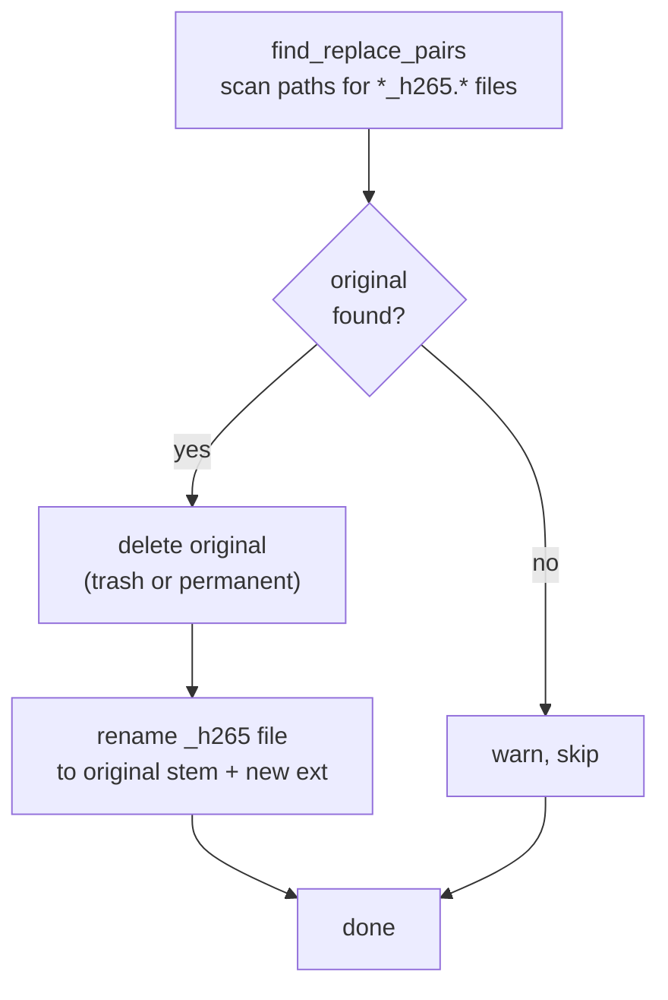
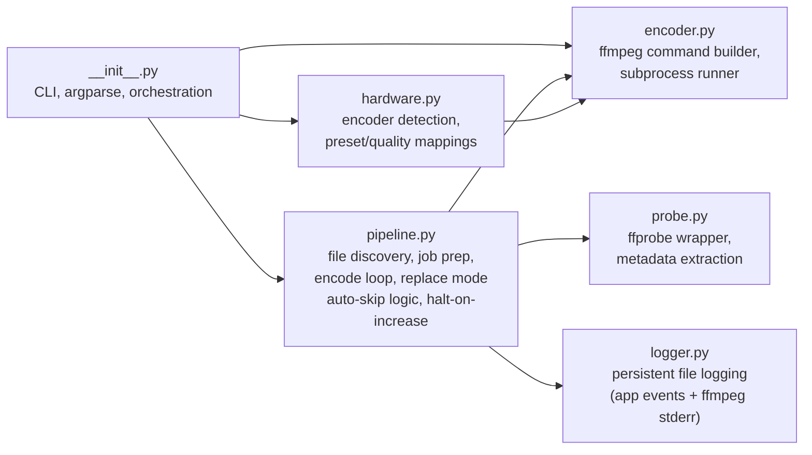

# Architecture

## High-level pipeline



## Encode path (per file)

Every encode (normal or `--yolo`) uses an atomic temp file. The final output only appears if the encode completes successfully. Size comparisons happen at two points:

- **Mid-stream**: a `cancel_check` callback polls the temp file every ~second; if it exceeds the original, ffmpeg is killed immediately.
- **Post-encode**: after ffmpeg exits cleanly, the temp file is compared to the original. If larger, it's deleted (auto-skip); if smaller, `os.replace()` moves it into place.



### Temp file naming

```
Normal mode:   video.mp4  →  video_h265.h265-tmp.mp4  →  video_h265.mp4
--yolo mode:   video.mp4  →  video.h265-tmp.mp4       →  video.mp4
```

The temp suffix `.h265-tmp` is inserted before the container extension. On success, `os.replace()` atomically renames the temp file to the final output path.

## Auto-skip and halt-on-increase

Auto-skip is always active (no flag needed). `--halt-on-increase` adds a batch-level gate on top.



During encoding, a mid-stream abort check polls the temp file every second; if it has already exceeded the original size, ffmpeg is killed early to save cycles.

### `--halt-on-increase` (`-H`)

With this flag, a batch-wide stop is triggered on the first oversized output. Without it, encoding continues with the remaining files (each oversized file is still auto-skipped).

## Crash recovery

No state file needed. The filesystem is the source of truth:



Because the temp file only becomes the final output via `os.replace()` (atomic on all modern filesystems), a partially-written file can never appear at the final path. Power loss, kill -9, kernel panic: no corruption.

## `--replace` mode (separate path)

No encoding happens. Finds existing `*_h265.*` files and swaps them with their originals.



Example:
```
video_h265.mp4 + video.mkv
  → trash video.mkv
  → rename video_h265.mp4 → video.mp4
```

## Module map



Each module uses `from __future__ import annotations`, dataclasses for structured data, and `pathlib.Path` exclusively.
