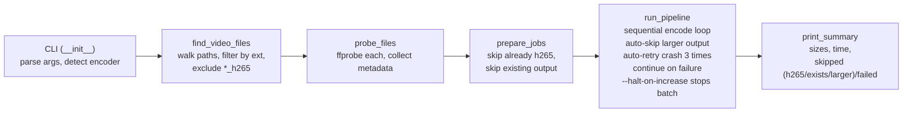
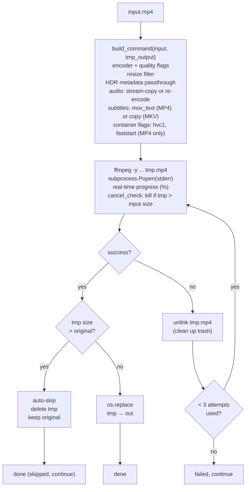
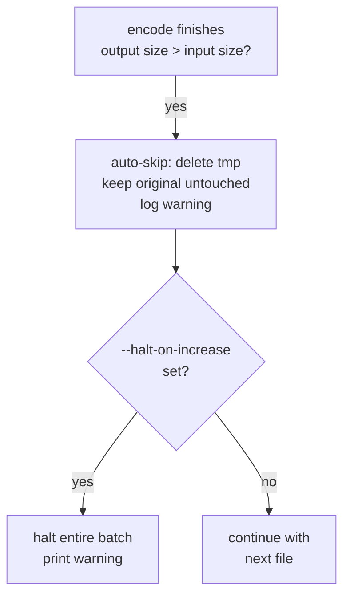
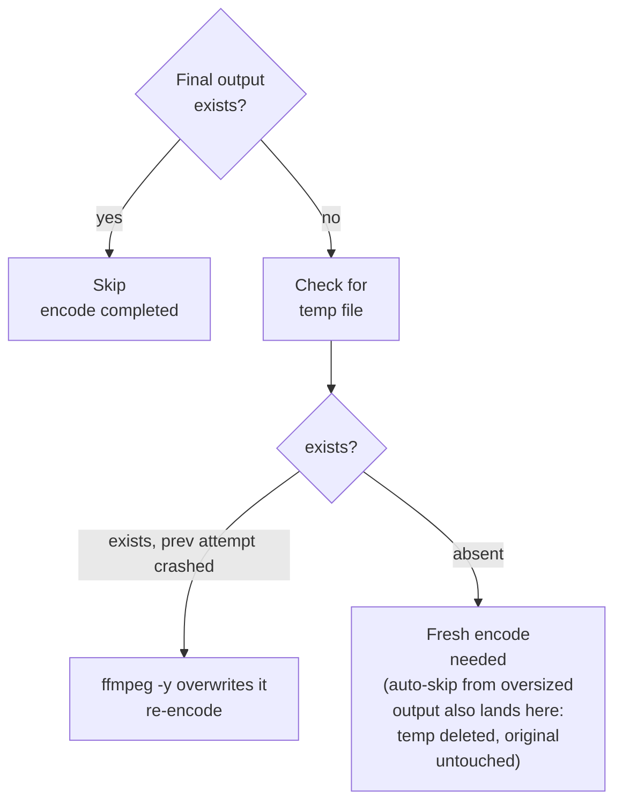
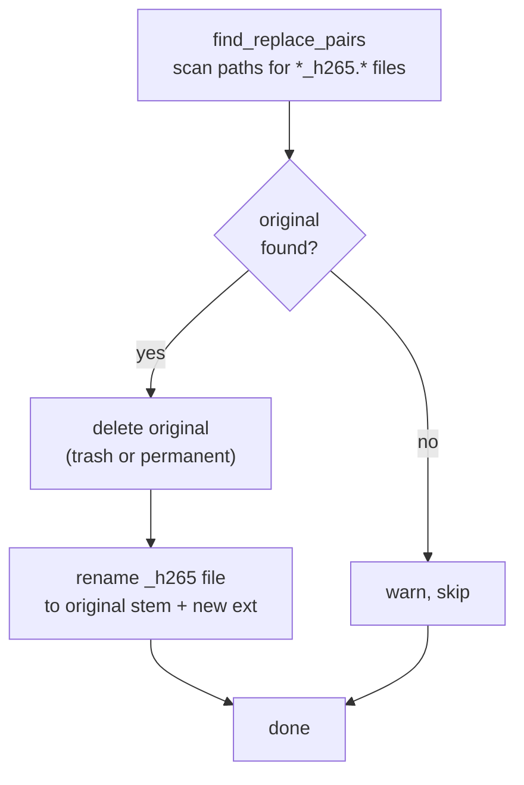
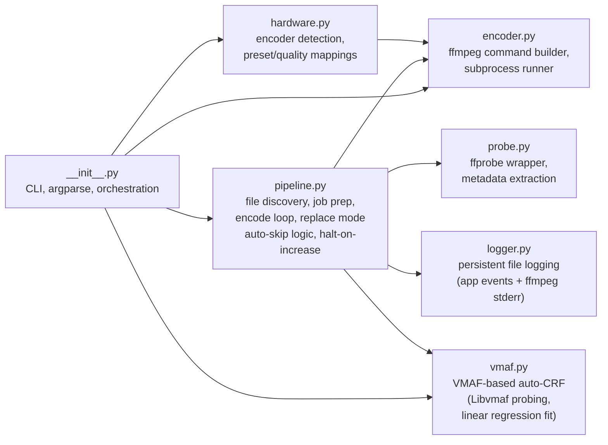
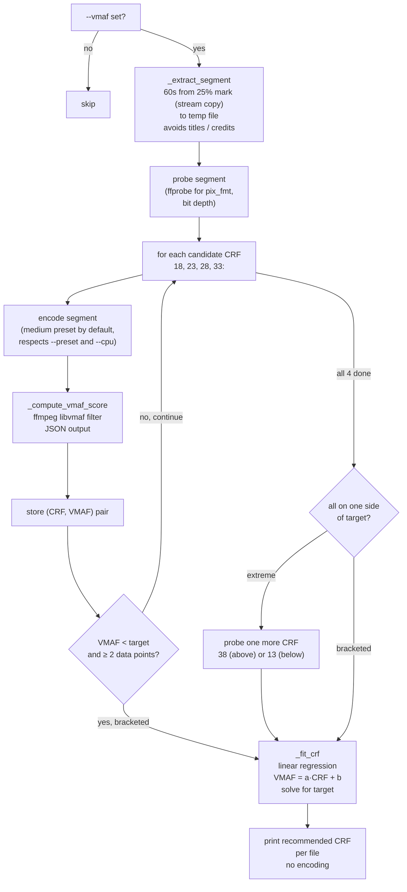

# Architecture

## High-level pipeline



## Encode path (per file)

Every encode (normal or `--yolo`) uses an atomic temp file. The final output only appears if the encode completes successfully. Size comparisons happen at two points:

- **Mid-stream**: a `cancel_check` callback polls the temp file every ~second; if it exceeds the original, ffmpeg is killed immediately.
- **Post-encode**: after ffmpeg exits cleanly, the temp file is compared to the original. If larger, it's deleted (auto-skip); if smaller, `os.replace()` moves it into place.



### Temp file naming

```
Normal mode:   video.mp4  →  video_h265.h265-tmp.mp4  →  video_h265.mp4
--yolo mode:   video.mp4  →  video.h265-tmp.mp4       →  video.mp4
```

The temp suffix `.h265-tmp` is inserted before the container extension. On success, `os.replace()` atomically renames the temp file to the final output path.

## Auto-skip and halt-on-increase

Auto-skip is always active (no flag needed). `--halt-on-increase` adds a batch-level gate on top.



During encoding, a mid-stream abort check polls the temp file every second; if it has already exceeded the original size, ffmpeg is killed early to save cycles.

### `--halt-on-increase` (`-H`)

With this flag, a batch-wide stop is triggered on the first oversized output. Without it, encoding continues with the remaining files (each oversized file is still auto-skipped).

## Crash recovery

No state file needed. The filesystem is the source of truth:



Because the temp file only becomes the final output via `os.replace()` (atomic on all modern filesystems), a partially-written file can never appear at the final path. Power loss, kill -9, kernel panic: no corruption.

On ffmpeg crash (non-zero exit), the temp file is cleaned up and the encode is automatically retried up to 2 more times (3 attempts total). If all attempts fail, the pipeline logs the failure and moves to the next file — the batch is not interrupted.

## `--replace` mode (separate path)

No encoding happens. Finds existing `*_h265.*` files and swaps them with their originals.



Example:
```
video_h265.mp4 + video.mkv
  → trash video.mkv
  → rename video_h265.mp4 → video.mp4
```

## Module map



## VMAF evaluation mode (`--vmaf`)

`--vmaf` is a standalone evaluation mode (mutually exclusive with `--replace`,
`--yolo`, and encoding flags). It probes each file to find the optimal CRF for
a target VMAF score, then reports the results — no encoding is performed.

### VMAF probing flow



### Key design decisions

- **Evaluation only**: no encoding happens after probing. The user gets a
  recommended CRF and decides what to do with it.
- **Same encoder and preset**: probe encodes use the user's chosen `--preset`
  and `--cpu` setting, matching real encode conditions.
- **Parallel probing**: all files probe concurrently using a thread pool.
  Results are printed atomically per-file.
- **Early stop**: probing stops as soon as a VMAF score falls below the
  target, since we have a bracket.

### Design decisions

- **60-second sample from the 25% mark**: avoids studio logos, title
  sequences, and end credits that don't represent the video's typical content.
- **For short videos (< 120s)**: samples from the beginning since there's no
  risk of unrepresentative introductory content.
- **Per-file probing**: each file gets its own CRF. Content complexity varies
  wildly — a CRF that works for animation may overshoot for live-action.
- **Linear regression**: VMAF and CRF have an approximately linear relationship
  in the useful range (CRF 18–35, VMAF ~98–85). Simple least-squares fit
  works better than binary search because VMAF measurements have some noise.
- **Same preset as real encode**: the probe encodes use the user's `--preset`
  (not hardcoded `veryfast`), so VMAF measurements reflect actual quality.

Each module uses `from __future__ import annotations`, dataclasses for structured data, and `pathlib.Path` exclusively.
